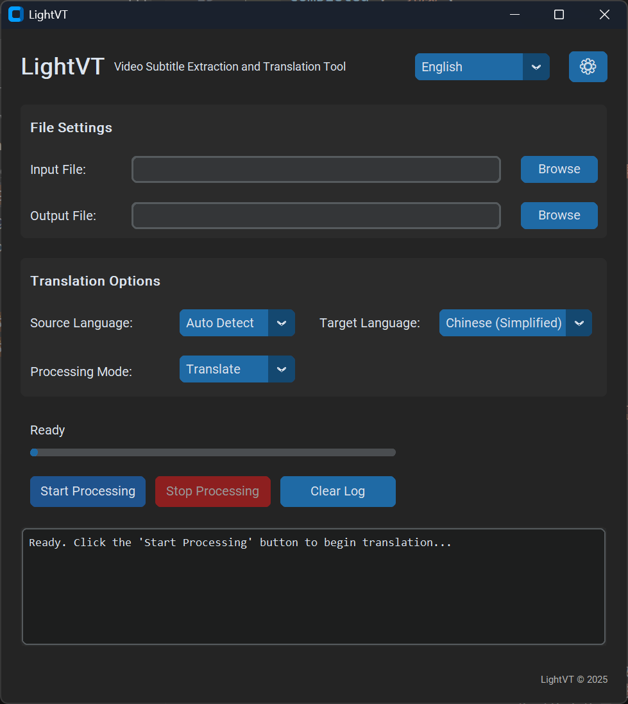
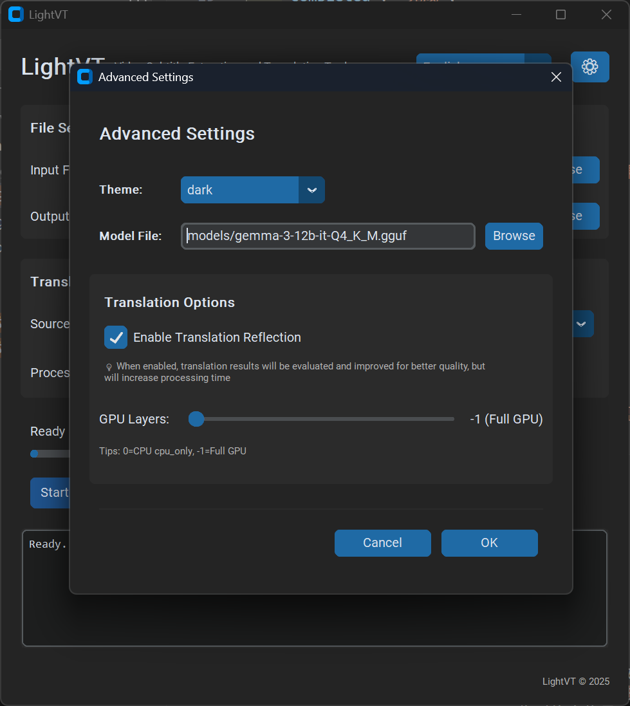
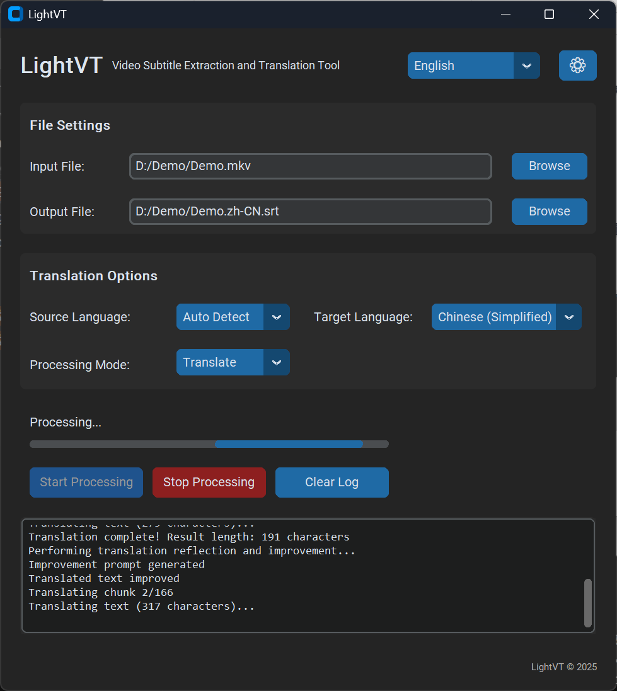

**Language | 语言**: [English](#english) | [简体中文](#简体中文)

# 🌟 LightVT

**A Lightweight Video Subtitle Translation Tool** | **一款轻量级视频字幕翻译工具**  

**Language is no longer a barrier to watching movies!** | **语言不再是观影的阻碍！** 

# English

## 📋 Overview

**LightVT** is an easy-to-use video subtitle translation software that uses advanced AI technology to help movie enthusiasts overcome language barriers and discover excellent film and television works from different cultures.

## ✨ Key Features

- 🎬 **Video Subtitle Extraction**: Intelligently extract subtitle content from video files
- 🌍 **Smart Translation**: High-quality multilingual translation based on large language models
- 📝 **Subtitle File Translation**: Directly process SRT subtitle files
- ⚡ **GPU Acceleration**: Support CUDA acceleration for significantly improved processing speed
- 🔧 **Simple Interface**: User-friendly graphical interface with intuitive operation

## 🛠️ System Requirements

### Optional Components

| Component | Purpose | Verification Command |
|-----------|---------|---------------------|
| **FFmpeg** | Subtitle extraction | `ffmpeg -version` |
| **CUDA** | Translation, GPU acceleration | `nvcc --version` |
| **NVIDIA Driver** | Translation, GPU support | `nvidia-smi` |

### Model Files
To use the translation function, you must have a large language model. The source code does not include large model files.

If you don't have one on your computer, download model files from the following sources:
- 📦 Built-in with project Releases
- 🤗 [HuggingFace Hub](https://huggingface.co/)

Recommended models:
- Minimum configuration: Qwen3-8B (suitable for 8GB+ VRAM)
- Recommended configuration: Gemma3-12B and above performance models (suitable for 12GB+ VRAM)

## 📺 Demo

  
  
  

## 🔧 Troubleshooting

<b>FFmpeg Not Found</b>

**Problem**: "ffmpeg command not found" error

**Solution**:
1. Download [FFmpeg](https://ffmpeg.org/download.html)
2. Add FFmpeg to system PATH
3. Restart terminal and verify: `ffmpeg -version`

<b>CUDA Related Errors</b>

**Problem**: GPU acceleration not working

**Solution**:
1. Confirm NVIDIA driver installation: `nvidia-smi`
2. Confirm CUDA Toolkit installation: `nvcc --version`
3. Check CUDA version compatibility (supports 11.8+)
4. If problems persist, disable GPU acceleration and use CPU mode

<b>Out of Memory</b>

**Problem**: Insufficient VRAM when processing large files

**Solution**:
1. Reduce GPU layer settings
2. Use smaller model files
3. Process long videos in segments

## 📈 Roadmap

- [x] ✅ Basic subtitle extraction functionality
- [x] ✅ AI translation integration
- [x] ✅ GPU acceleration support
- [x] ✅ Graphical user interface
- [ ] 🔄 Smart terminology
- [ ] 🔄 Cloud model support
- [ ] 🔄 Bilingual subtitle output

## 🙏 Acknowledgments

- [llama.cpp](https://github.com/ggerganov/llama.cpp) - High-performance LLM inference
- [FFmpeg](https://ffmpeg.org/) - Multimedia processing framework
- [CustomTkinter](https://github.com/TomSchimansky/CustomTkinter) - Modern Python GUI framework
- [HuggingFace](https://huggingface.co/) - Model hosting platform

---

**If this project helps you, please give us a ⭐**

[🐛 Report Issues](https://github.com/fispurring/lightVT/issues) · [💡 Feature Requests](https://github.com/fispurring/lightVT/discussions)

---

# 简体中文

## 📋 概要

**LightVT** 是一款简单易用的视频字幕翻译软件，使用先进的AI技术帮助影视爱好者跨越语言障碍，发掘并欣赏来自不同文化的优秀影视作品。

## ✨ 主要特征及功能

- 🎬 **视频字幕提取**：从视频文件中智能提取字幕内容
- 🌍 **智能翻译**：基于大语言模型的高质量多语言翻译
- 📝 **字幕文件翻译**：直接处理 SRT 字幕文件
- ⚡ **GPU 加速**：支持 CUDA 加速，显著提升处理速度
- 🔧 **简洁界面**：用户友好的图形界面，操作简单直观

## 🛠️ 系统要求

### 可选组件

| 组件 | 用途 | 验证命令 |
|------|------|----------|
| **FFmpeg** | 字幕提取 | `ffmpeg -version` |
| **CUDA** | 翻译，GPU加速 | `nvcc --version` |
| **NVIDIA驱动** | 翻译，GPU支持 | `nvidia-smi` |

### 模型文件
要使用翻译功能，必须要有大语言模型，源代码不包含大模型文件。

如果你的电脑上没有，从以下来源下载模型文件：
- 📦 项目 Releases 包内自带
- 🤗 [HuggingFace Hub](https://huggingface.co/)  

推荐模型：
- 最低配置：Qwen3-8B (适合8GB+显存)
- 推荐配置：Gemma3-12B及以上性能的模型(适合12GB+显存)

## 📺 演示

  
  
  

## 🔧 常见问题

<b>FFmpeg 未找到</b>

**问题**：提示 "ffmpeg command not found"

**解决方案**：
1. 下载 [FFmpeg](https://ffmpeg.org/download.html)
2. 将 FFmpeg 添加到系统 PATH
3. 重启终端并验证：`ffmpeg -version`

<b>CUDA 相关错误</b>

**问题**：GPU 加速不工作

**解决方案**：
1. 确认安装 NVIDIA 驱动：`nvidia-smi`
2. 确认安装 CUDA Toolkit：`nvcc --version`
3. 检查 CUDA 版本兼容性（支持 11.8+）
4. 如果仍有问题，可禁用 GPU 加速使用 CPU 模式

<b>内存不足</b>

**问题**：处理大文件时显存不足

**解决方案**：
1. 减少 GPU 层数设置
2. 使用较小的模型文件
3. 分段处理长视频

## 📈 开发路线图

- [x] ✅ 基础字幕提取功能
- [x] ✅ AI 翻译集成
- [x] ✅ GPU 加速支持
- [x] ✅ 图形用户界面
- [ ] 🔄 智能术语表
- [ ] 🔄 云端模型支持
- [ ] 🔄 输出双语字幕

## 🙏 致谢

- [llama.cpp](https://github.com/ggerganov/llama.cpp) - 高性能 LLM 推理
- [FFmpeg](https://ffmpeg.org/) - 多媒体处理框架
- [CustomTkinter](https://github.com/TomSchimansky/CustomTkinter) - 现代化Python GUI 框架
- [HuggingFace](https://huggingface.co/) - 模型托管平台

---

**如果这个项目对您有帮助，请给我们一个 ⭐**

[🐛 报告问题](https://github.com/fispurring/lightVT/issues) · [💡 功能建议](https://github.com/fispurring/lightVT/discussions)

